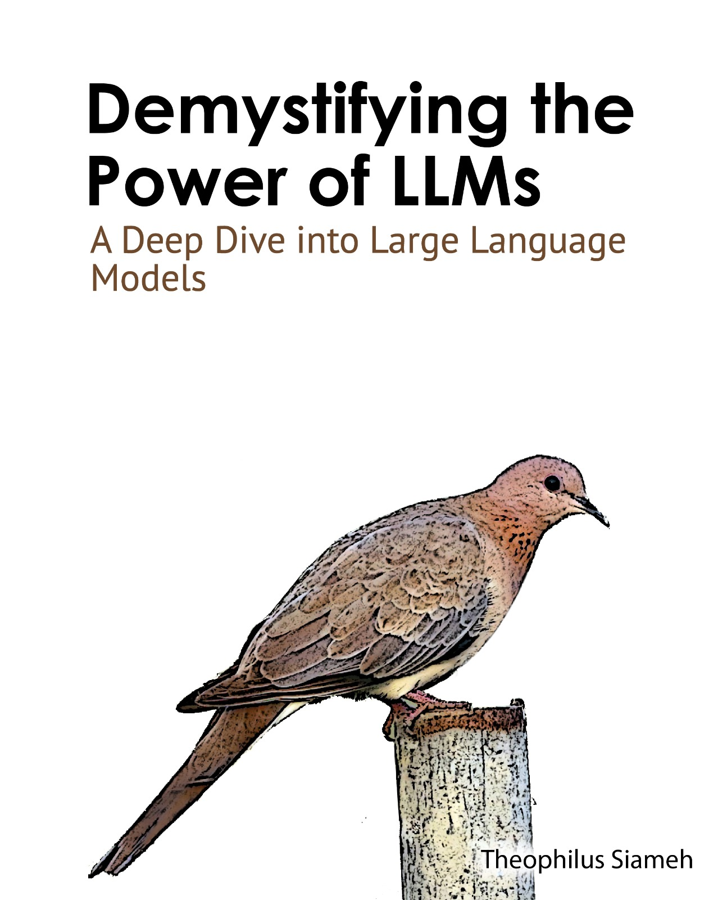

🚀 Just Launched! 🚀 June, 2024.
### Title: 📚 [Demystifying the Power of Large Language Models](https://www.amazon.com/Demystifying-Power-Large-Language-Models/dp/B0D6443WY8): A Deep Dive into Large Language Models 🤖💡

Dive into the cutting-edge world of LLMs with our comprehensive guide! 🌍📘 Here’s what you’ll discover:
### Chapters
 - Brief History of LLMs 🕰️🔍
 - Intro to LLMs 🤖✨
 - Large Language Models
 - Transformer Architecture 🔄🏗️
 - Dataset Engineering 🛠️📊
 - Pretrained Models 📚🤝
 - Supervised Fine-Tuning 📈🔧
 - Reinforcement Learning from Human Feedback(RLHF) 🎮🙋‍♂️
 - Parameter Efficient Fine-Tuning(PEFT) 🧩🔍
 - Large Multimodal Models 🖼️🔊
 - LLM Evaluation 📉🔎
 - LLM Quantization ⚖️⚙️
 - LLM Platforms
 - Vector Databases 🗂️🔠
 - Retrieval Augmented Generation (RAG) 🔍🤔
 - LLM Inference Optimization 🚀💻
 - LLM Deployment 🚀🖥️
 - Securing LLMs 🔒🛡️
 - LLM Model Merging 🔗🤯
 - LLM Agents
 - OpenAI API

Get ready to unlock the secrets behind today's most powerful AI models! 🔑✨ Grab your copy on Amazon(https://a.co/d/gdxgO5T) now and embark on your LLM adventure! 🌟📖

### Author
  - [Theophilus Siameh](https://www.linkedin.com/in/theophilus-siameh-793a8626/)
     - **Reviewers**: [Thomas Torku, PhD.](https://www.linkedin.com/in/thomas-torku-ph-d-912739a8/), [Israel Fianyi, PhD.](https://www.linkedin.com/in/israel-fianyi-phd-2029aa56/), [Collins Agyekum](https://www.linkedin.com/in/collins-agyekum-13b30698) and [Abigail Addobea](https://www.linkedin.com/in/madam-akosua-addobea08/).